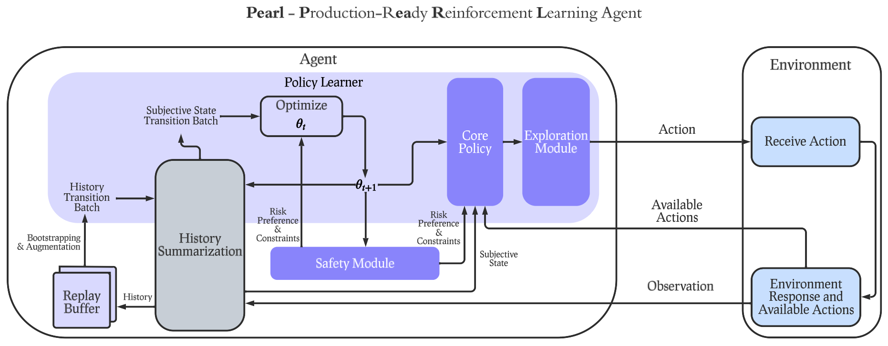

# Pearl - A Production-ready Reinforcement Learning AI Agent Library
### Proudly brought by Applied Reinforcement Learning @ Meta

- v0.1 - Pearl beta-version is now released! Announcements: [Twitter Post](https://x.com/ZheqingZhu/status/1732880717263352149?s=20), [LinkedIn Post](https://www.linkedin.com/posts/zheqingzhubill_github-facebookresearchpearl-a-production-ready-activity-7138647748102258688-rz-g?utm_source=share&utm_medium=member_desktop)
  - Highlighted on Meta NeurIPS 2023 Official Website: [Website](https://ai.meta.com/events/neurips-2023/)
  - Highlighted by AI at Meta official handle on Twitter and LinkedIn: [Twitter Post](https://x.com/AIatMeta/status/1734633932975407202?s=20), [LinkedIn Post](https://www.linkedin.com/posts/aiatmeta_neurips2023-activity-7140398603868549120-5T7E?utm_source=share&utm_medium=member_desktop).

[](https://opensource.org/licenses/MIT)
[](https://opensource.fb.com/support-ukraine)
[](https://codecov.io/gh/facebookresearch/Pearl)

More details of the library at our [official website](https://pearlagent.github.io).

The Pearl paper is [available at Arxiv](https://chs6.short.gy/pearl_paper).

Our NeurIPS 2023 Presentation Slides is released [here](https://pearlagent.github.io/pearl_detailed_intro.pdf).

## Overview
Pearl is a new production-ready Reinforcement Learning AI agent library open-sourced by the Applied Reinforcement Learning team at Meta. Furthering our efforts on open AI innovation, Pearl enables researchers and practitioners to develop Reinforcement Learning AI agents. These AI agents prioritize cumulative long-term feedback over immediate feedback and can adapt to environments with limited observability, sparse feedback, and high stochasticity. We hope that Pearl offers the community a means to build state-of-the-art Reinforcement Learning AI agents that can adapt to a wide range of complex production environments.

## News

### January 22, 2025 - Pearl components serialization
Pearl components can now produce state dicts just like PyTorch modules, and these state dicts can be saved and loaded with `torch.save` and `torch.load`!

Here's a basic example:
```python
agent = PearlAgent(...)
# Save the agent's state dict
torch.save(agent.state_dict(), 'agent_state.pth')

agent2 = PearlAgent(...)  # agent2 must have the same structure as agent
# Load the agent's state dict
agent2.load_state_dict(torch.load('agent_state.pth'))

assert agent2.compare(agent) == ""  # `compare` is a newly introduced method
```
Note that this works for subcomponents as well, such as `PolicyLearner`, `ExplorationModule`, etc.

If your component has attributes that are not parameters, buffers, or sub-modules, they are not included automatically in the state dict.
In those cases, (just like in PyTorch) define methods `get_extra_state` and `set_extra_state` for including such attributes in the state dict
(see, for example, [`ActorCriticBase.get_extra_state`](https://github.com/facebookresearch/Pearl/blob/01c16fd482ade4e6c5d3bc7a83f3c7065f9afa8d/pearl/policy_learners/sequential_decision_making/actor_critic_base.py#L415)).

When defining your own components, you must now define a `compare` method which returns a string listing the differences between two components
(see, for example, [`PearlAgent.compare`](https://github.com/facebookresearch/Pearl/blob/01c16fd482ade4e6c5d3bc7a83f3c7065f9afa8d/pearl/pearl_agent.py#L286)).
This method serves as a general comparison method for testing purposes.

## Getting Started

### Installation
To install Pearl, you can simply clone this repository and run `pip install -e .` (you need `pip` version ≥ 21.3 and `setuptools` version ≥ 64):
```bash
git clone https://github.com/facebookresearch/Pearl.git
cd Pearl
pip install -e .
```

### Quick Start
To kick off a Pearl agent with a classic reinforcement learning environment, here's a quick example.
```py
from pearl.pearl_agent import PearlAgent
from pearl.action_representation_modules.one_hot_action_representation_module import (
    OneHotActionTensorRepresentationModule,
)
from pearl.policy_learners.sequential_decision_making.deep_q_learning import (
    DeepQLearning,
)
from pearl.replay_buffers import (
    BasicReplayBuffer,
)
from pearl.utils.instantiations.environments.gym_environment import GymEnvironment

env = GymEnvironment("CartPole-v1")

num_actions = env.action_space.n
agent = PearlAgent(
    policy_learner=DeepQLearning(
        state_dim=env.observation_space.shape[0],
        action_space=env.action_space,
        hidden_dims=[64, 64],
        training_rounds=20,
        action_representation_module=OneHotActionTensorRepresentationModule(
            max_number_actions=num_actions
        ),
    ),
    replay_buffer=BasicReplayBuffer(10_000),
)

observation, action_space = env.reset()
agent.reset(observation, action_space)
done = False
while not done:
    action = agent.act(exploit=False)
    action_result = env.step(action)
    agent.observe(action_result)
    agent.learn()
    done = action_result.done
```
Users can replace the environment with any real-world problems.

## Tutorials

We provide a few tutorial Jupyter notebooks (and are currently working on more!):

1. [A single item recommender system](https://nbviewer.org/github/facebookresearch/Pearl/blob/main/tutorials/single_item_recommender_system_example/single_item_recommender_system.ipynb). We derived a small contrived recommender system environment using the MIND dataset (Wu et al. 2020).

2. [Contextual bandits](https://nbviewer.org/github/facebookresearch/Pearl/blob/main/tutorials/contextual_bandits/contextual_bandits_tutorial.ipynb). Demonstrates contextual bandit algorithms and their implementation using Pearl using a contextual bandit environment for providing data from UCI datasets, and tested the performance of neural implementations of SquareCB, LinUCB, and LinTS.

3. [Frozen Lake](https://nbviewer.org/github/facebookresearch/Pearl/blob/main/tutorials/frozen_lake/frozen_lake.ipynb). A simple example showing how to use a one-hot observation wrapper to learn the classic problem with DQN.

4. [Deep Q-Learning (DQN) and Double DQN](https://nbviewer.org/github/facebookresearch/Pearl/blob/main/tutorials/sequential_decision_making/DQN_and_DoubleDQN_example.ipynb). Demonstrates how to run DQN and Double DQN on the Cart-Pole environment.

5. [Actor-critic algorithms with safety constraints](https://nbviewer.org/github/facebookresearch/Pearl/blob/main/tutorials/actor_critic_and_rc_safety_module/actor_critic_and_safe_actor_critic.ipynb). Demonstrates how to run Actor Critic methods, including a version with safe constraints.


## Design and Features

Pearl was built with a modular design so that industry practitioners or academic researchers can select any subset and flexibly combine features below to construct a Pearl agent customized for their specific use cases. Pearl offers a diverse set of unique features for production environments, including dynamic action spaces, offline learning, intelligent neural exploration, safe decision making, history summarization, and data augmentation.

You can find many Pearl agent candidates with mix-and-match set of reinforcement learning features in utils/scripts/benchmark_config.py

## Adoption in Real-world Applications
Pearl is in progress supporting real-world applications, including recommender systems, auction bidding systems and creative selection. Each of them requires a subset of features offered by Pearl. To visualize the subset of features used by each of the applications above, see the table below.
<center>

|Pearl Features | Recommender Systems | Auction Bidding | Creative Selection |
|:-------------:|:-------------------:|:---------------:|:------------------:|
|Policy Learning| ✅ |✅|✅|
|Intelligent Exploration|✅|✅ |✅|
|Safety| | ✅ | |
|History Summarization| | ✅ | |
|Replay Buffer| ✅ |✅ |✅ |
|Contextual Bandit| | |✅|
|Offline RL|✅|✅||
|Dynamic Action Space|✅||✅|
|Large-scale Neural Network|✅|||

</center>

## Comparison to Other Libraries
<center>

|Pearl Features | Pearl  | ReAgent (Superseded by Pearl) | RLLib | SB3|Tianshou | Dopamine |
|:-------------:|:------:|:-----------------------------:|:-----:|:--:|:-----:|:----:|
|Agent Modularity|✅|❌|❌|❌|❌|❌|
|Dynamic Action Space|✅|✅|❌|❌|❌|❌|
|Offline RL|✅|✅|✅|✅|✅|❌|
|Intelligent Exploration|✅|❌|❌|❌|⚪ (limited support)|❌|
|Contextual Bandit|✅|✅|⚪ (only linear support)|❌|❌|❌|
|Safe Decision Making|✅|❌|❌|❌|❌|❌|
|History Summarization|✅|❌|✅|❌|⚪ (requires modifying environment state)|❌|
|Data Augmented Replay Buffer|✅|❌|✅|✅|✅|❌|

</center>

## Cite Us
```
@article{pearl2023paper,
    title = {Pearl: A Production-ready Reinforcement Learning Agent},
    author = {Zheqing Zhu, Rodrigo de Salvo Braz, Jalaj Bhandari, Daniel Jiang, Yi Wan, Yonathan Efroni, Ruiyang Xu, Liyuan Wang, Hongbo Guo, Alex Nikulkov, Dmytro Korenkevych, Urun Dogan, Frank Cheng, Zheng Wu, Wanqiao Xu},
    eprint = {arXiv preprint arXiv:2312.03814},
    year = {2023}
}
```

## License
Pearl is MIT licensed, as found in the LICENSE file.
